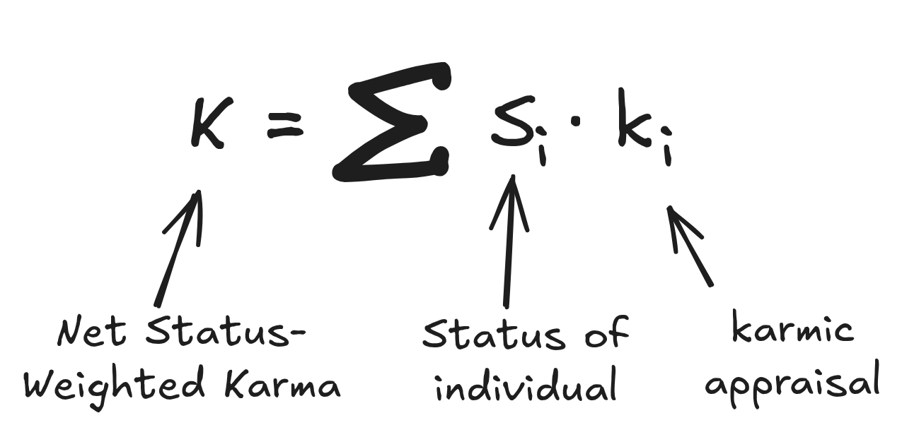

# TL;DR

Corporate performance evaluation is not a function of work quality; it is a function of **Status-Weighted Stories**.

This document patches the [Default Engineering Worldview](./04-security-advisory.md) (which assumes meritocracy) with **KarmaRank**, a transitive, narrative-aggregating algorithm over the corporate social graph.

> **KarmaRank:** Time-Decayed, Capital-Constrained, Adversarial Eigenvector-Sponsorship.

While this full KarmaRank definition describes the actual appraisal process, for the day-to-day practitioner, it suffices to optimize for **Net Status-Weighted Karma**:

$$
K = \sum_{i} S_i \cdot k_i
$$

Where:

* **$K$ — Net Status-Weighted Karma**  
  In a given field: a company, a team, a subculture, a community.
* **$i$ — The Index**  
  Ranging over the people whose opinions about you actually _travel_—your manager, your manager's peers, the Staff engineer everyone listens to, the PM who won't shut up in calibration meetings.
* **$S_i$ — Status**  
  Intentionally capitalized, because it's the most important term. It's not just the witness's job title, but their actual ability to move decisions and narratives as it pertains _to you_.
* **$k_i$ — Karmic Appraisal**  
  The signed "emotional value" person $i$ gets from telling a story about you and your work.

The KarmaRank Manifesto proceeds from this, explaining how to decouple your self-worth from your rating ([Law #1](./05-law-1.md)),
optimize your output for the **Firm Ledger**, and maximize your karmic ROI within your local [Calibration Cylinder](./09-calibration-cylinder.md).

