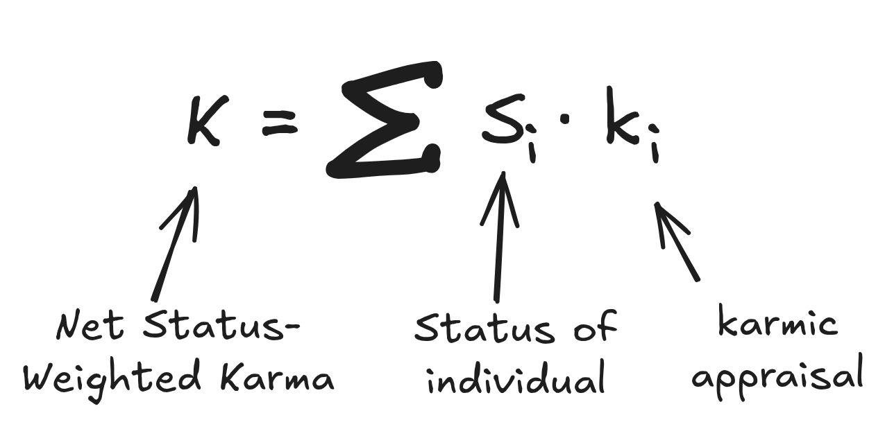

# KarmaRank: Origin Story (with Math)

## 1. The Toy Demo and the Wrong Scoreboard

In that cold fishbowl conference room, my manager looked decidedly displeased. Her face was flushed, which was saying something for someone normally so amiable. The face of you're-about-to-get-PIP'd.

I rubbed my wrist, sore from days of furious typing. I'd been getting in early and staying late, trying to wrestle my codebase into something that met all the requirements. Somehow, it still wasn't enough.

I didn't know it yet, but we were playing by two different scoreboards.

---

It all started a few weeks earlier, when I built a cool little demo.

It was a novel data visualization for one very specific dataset. On that one dataset, it looked great. You could project it in a meeting and everyone would nod and go, "Wow, that's neat."

My managers liked it. Then they did the obvious manager thing: "Can you make this work for arbitrary datasets?"

I said yes, because of course I did. In hindsight, that was insane. Data comes in all shapes, sizes, and pathologies. Turning a bespoke showpiece into a robust, general system is a whole other level.

I started working, and in my head, I was optimizing for **my** scoreboard: clean abstractions, maintainable code, a system I wouldn't be ashamed to revisit in six months. I was chasing the feeling of having built something elegant and general.

My manager, it turned out, was optimizing for a different scoreboard entirely, one I hadn't fully seen yet.

## 2. HR Doxa vs What She Actually Meant

As the weeks ticked by and the generalized version stubbornly refused to be "done," my manager started leaning on me with what I now recognize as **HR doxa**—language whose literal content is less important than its emotional payload.

She would say things like, "You need to focus on priorities," and "How can I help?"

Being an engineer, I interpreted these word-sounds at face value. When she asked how she could help, I went away and made a groomed backlog. I put together a spreadsheet of **features**, **estimates**, and **priorities**, then walked into our 1:1 with an ordered list, ready to talk tradeoffs and timelines like a grown-up product owner.

She glanced at it, eyes glazed, then back to me.

Not angrily. It just didn't register as _relevant data_. I'd brought her a beautifully formatted map of the territory **I** cared about: architecture, features, technical sequence. She lived in a different terrain entirely: **people, stories, moods, status**.

From her point of view, that spreadsheet was beside the point until there was at least one human somewhere in the org saying, "This helped us." Until there was a real person, in a real team, with a real story, the internal structure of my backlog was just décor.

We were using the same words—focus, priorities, help—to play two different games. I thought we were collaborating on how to architect a nice piece of software. She was trying to succeed at **being my manager in an org that cares about certain metrics and not others**. That mismatch simmered for a while.

## 3. The Objective Function Reveals Itself

Eventually the tension boiled over.

Back in the cold fishbowl, she came to our 1:1 visibly frustrated, face flushed—the kind of affect where you can tell someone has been defending you in other rooms and is running out of narrative. An amiable woman with a slight frame, it took a lot for her to become visibly flustered.

She said:

> "Look, in two weeks I and <other manager> are going to <corp HQ> for a meeting with <boss's boss>. We need to be able to tell them **who your software has helped and how**."

And suddenly, the room tilted.

Oh.

There it was: the **actual objective function**, finally stated in plain language.

The key questions were not, "Is the architecture future-proof?" or "Is the codebase beautiful?" The key questions were:

- "**Who has this helped?**" (concrete users)
- "**How?**" (a story you can tell in a meeting)

All of that was constrained by a simple deadline: "In time for that HQ meeting, two weeks from now."

In that moment, my entire understanding of "value" in that context snapped into focus. My personal value system—maintainable code, generality, elegance—was a **proxy**. The institution's value system, at least for this project, was:

> **Do I have success stories I can say out loud to high-status people, on this date?**

## 4. Optimizing for the Real Metric

Once I understood the metric, it was optimizable.

I stopped trying to engineer a perfectly general system and started treating the next two weeks as a **bounded experiment** with a clear payoff: generate at least one, preferably two, credible success stories attached to real users before the HQ meeting.

I cut an alpha build of the tool, ignoring what to me were glaring bugs in the design and went fully white glove. I reached out to potential teams in the building with data visualization problems. I plugged in their data and made hasty changes to fix **their specific issues**.

I parked myself at collaborators' desks while they poked around so I could gauge their responses. When the tool broke, I hacked in quick, local fixes. When it sort of worked, I stayed just long enough to make sure they could tell a coherent "this helped us do X" story later, without me in the room.

Within those two weeks, I snagged two concrete success stories—things like, "Team A used this to finally see Y, which unblocked Z," and "Team B used this visualization to explain W to their stakeholders." The exact details don't matter; what mattered was that they were legible and repeatable.

The HQ meeting was a success. My manager's affect flipped from flushed frustration to relieved pride. From the outside, the story became, "this guy finally focused and delivered." From the inside, the story was:

> "I finally found the **real scoreboard** and stopped optimizing for my private one."

## 5. Writing Down the Algorithm: Net Status-Weighted Karma

I was so pleased with myself for decoding the game that I did what I always do when I think I've spotted a pattern: I tried to turn it into math. In my notebook, I wrote down a simple expression for what I'd just experienced:

$$
K = \sum_{i} S_i \cdot k_i
$$

Here, $K$ is your **Net Status-Weighted Karma** in a given field: a company, a team, a subculture, a community.

The index $i$ ranges over the people whose opinions about you actually **travel**—your manager, your manager's peers, the Staff engineer everyone listens to, the PM who won't shut up in calibration meetings.

For each such person, $k_i$ is your **karma with person** $i$: the signed "emotional value" they get from telling a story about you and your work.

- A positive $k_i$ is, "She saved our launch with that tool."
- A negative $k_i$ is, "He keeps slipping deadlines and making excuses."

The last term, $S_i$, is their **Status** in this field—capital $S$ on purpose, because it's the most important term. It's not just job title, but their actual ability to move decisions and narratives as it pertains _to you_. It's a weight: how much their stories about you count when they reach the people who allocate promotions, opportunities, and resources.

The implications are brutally simple. Helping a lot of low-Status people a little versus helping a few high-Status people a lot can produce the same Net Karma. From a purely karmic ROI perspective, it is **cheaper** to create one ecstatic director than ten mildly satisfied ICs. One well-placed success story can outweigh a dozen quiet "yeah, it's fine"s lower in the hierarchy.

That's what I'd just done, accidentally. I hadn't "improved the codebase" in some abstract, global sense. I had improved my **Net Karma** by creating a couple of high-weight $S_i$ nodes who could now tell positive stories ($k_i > 0$) about me in a critical meeting.

## 6. Showing My Manager the Formula

Pleased with my little equation, I showed it to my manager.

I explained, cheerfully, something like:

> "Look, I get it now. My value to the org is basically the sum over people of how much they like telling stories about me, weighted by their status. So my job is to create high-status, positive storytellers. That's what I optimized for with the alpha."

Silence.

This was bad. Silence from an amiable person is a sign of deep disagreement or distress.

It wasn't the kind of distress you get when the math is wrong. It was the kind you get when someone has said the quiet part out loud. Her expression read as: _Please don't say this in exactly these words, ever again, to anyone who signs my paycheck._

At the time, I was confused. I thought I was reassuring her: "I understand your constraints. I can optimize for what you actually need." What she reasonably heard was closer to: "I have reverse-engineered the social game you are embedded in and I am now explicitly min-maxing your boss's feelings about me."

In retrospect, that was my first clear encounter with a meta-rule of corporate life:

**You are allowed to play the game.**  
**You are not supposed to write down the rules.**

The organization must persist a story about "merit" and "impact" that is neutral, objective, and morally acceptable. Writing it as a status-weighted sum of feelings about you is not morally acceptable, even if it's descriptively accurate.

## 7. Habitus: Why It Was Easy for Her and Hard for Me

In hindsight, my manager was doing something I didn't have language for yet.

She was a **natural affective-labor manager**. She spoke fluent HR doxa. She could feel, without effort, which stories would land in a VP's office and which wouldn't. She had an internal gyroscope that told her what kinds of updates, phrased in what kinds of ways, would count as "real impact" versus "nice-to-have tinkering."

A sociologist would say she had the right **habitus** for that field: the internalized feel for how things are done, what counts as real, what counts as "impactful" versus merely interesting. The norms of that space lived in her body. Maybe it was natural. Maybe honed from years of practice. (See [Bourdieu](#pierre-bourdieu))

I had the opposite profile. I could build the tool and explain the design, but I had almost no feel for that emotional-political terrain. She **intuitively** tracked who mattered, what they cared about, and which narratives they were hungry for. I had to **derive** all of that on paper, after getting smacked by reality.

Some people are born into—or trained into—the right habitus for a given field. They just "get" what counts, who matters, what to say in which room. The rest of us end up reverse-engineering it after enough humiliations.

KarmaRank is basically my adaptation for that asymmetry: a way for people like me—who don't come pre-installed with the right habitus—to see the game board clearly enough that we don't have to learn it all the hard way.

## 8. From Net Karma to KarmaRank

The leap from Net Karma to KarmaRank comes from realizing that everyone is playing the same game. That is, the formula is **transitive**.

The people with high Status to you are themselves embedded in their own **field**, trying to secure karma from others who have high Status to them. People trade various forms of **capital**—social clout, headcount, literal budget, corporate rank, etc.—in order to improve their positions. Combine the individual perspective with Google's PageRank algorithm (iteratively re-scoring pages in the hyperlink graph) and you arrive at KarmaRank.

Everyone has the same job: to secure **Status-Weighted Stories** in a **dynamic, heterogenous field**, and call this narrative aggregation "impact."

Some people intuit this. Good for them. The rest of us have to write it down.

KarmaRank is for the second group. You don't have to struggle through a decade of half-failed projects and flushed 1:1s to see KarmaRank. I did that part for you.
