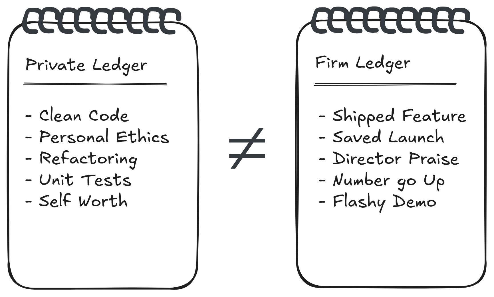

# Law #1: The Two Ledgers

You are running two ledgers in one head.

In your **Private Ledger** you keep score in terms of craft and ethics. "Did I build the right thing?" "Is it correct, elegant, fair?" It's your local religion. You don't need anyone's permission to maintain it. Taste is pre-rational.

On the other ledger, the **Firm Ledger**, the firm keeps score in terms of stories that travel. "Who says you helped them?" "How easy is it to repeat that story up the chain?" Its unit of account is the **Status-Weighted Story** about you, passed between people who can move budget, headcount, and promotion packets.

It is a common yet critical mistake to assume these ledgers are the same system with some measurement noise, like a single, eventually consistey database. They are not. They are different databases with different schemas, occasionally synced only by accident. Like a hash collision.

When you stay late refactoring code nobody will ever hear about, that's a Private Ledger credit. When a director tells a VP "she saved our launch," that's a Firm Ledger credit. These events often do not coincide in time, or at all.

From the firm's point of view, your Private Ledger is an personal hobby (on company time!). They don't query it. They query the Firm Ledger, then serialize the result into ratings, levels, and comp.

Whether you treat the Firm Ledger as morally authoritative is your business. This text only cares that you stop expecting Private Ledger entries to auto-replicate into a system that never subscribed to that table.
