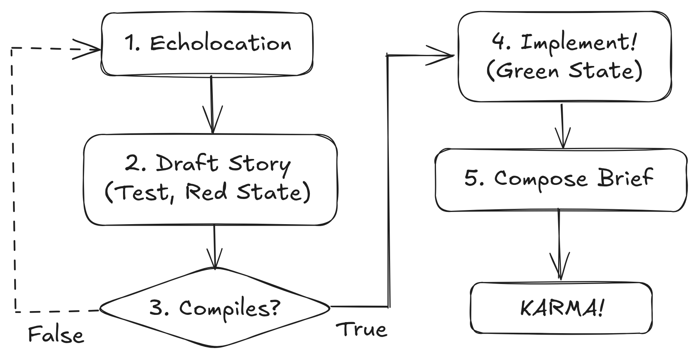

# Tactics I: Karma-Driven Development (KDD)

In software engineering, the most disciplined teams practice **Test-Driven Development (TDD)**. The rule is simple: **Red, Green, Refactor.**

1.  **Red:** Write a test that fails (because the feature doesn't exist yet).
2.  **Green:** Write just enough code to make the test pass.
3.  **Refactor:** Clean up the code.

Most careers, however, run on **Waterfall**. You do months of work, ship it, and then hope that HR writes a test that you happen to pass. This is madness. You are building features without a spec.

To fix this, we will adopt **Karma-Driven Development (KDD)**. In this framework, you never write a line of code until you have written the performance review bullet point that rewards it. Remember Law #2, the rating is the job.

## Phase 1: Backlog Grooming (Political Echolocation)

Before you can write a test, you need requirements.

Right now, your mental backlog is likely full of "Technical Debt" and "Cool Ideas." You might be tempted to pick the one that looks most intellectually stimulating.

Stop. You cannot sort this list by **Technical Merit** (Private Ledger). You must sort it by **Market Demand** (Firm Ledger).

To do this, you must leave your IDE and perform **Political Echolocation**. You need to ping the network to see what returns a signal.

### The "Hard Problem" Heuristic

Schedule a 15-minute sync with a High-Status Node ($S_i$)—a Staff Engineer, a Principal PM, or your Skip-Level Manager.

Do not ask: _"What should I work on?"_ That makes you look like a junior execution-bot.

Instead, ask for their **mental model** (a "calibrated question" in [Voss's](#chris-voss) terms):

> "I'm looking at our Q3 technical roadmap, and I know you've been thinking a lot about [Strategic Theme X]. How does [Project Y] fit into your mental model of that problem?"

This accomplishes three things:

1.  **The Ben Franklin Effect:** Benjamin Franklin famously observed that he who has done you a kindness will be more ready to do you another. By asking for their "wisdom," you make them feel like a visionary. They invest in you. They now have a subconscious stake in your success because you are a vessel for their ideas.

2.  **Signal Detection:**

    - If they look bored or give a generic answer: **Low $k_i$ (Caring).** Delete the ticket.
    - If they lean in, start drawing on the whiteboard, or vent about a specific pain point: **High $k_i$.** Move this to the top of the backlog.

3.  **Cache Warming (The Mere Exposure Effect):**
    In the Calibration Courtroom, when your name comes up, you do not want the Jury to do a cold lookup.
    - _Cold Lookup:_ "Who? Oh, the backend dev? Okay."
    - _Warm Cache:_ "Oh, right. Smart dev. We chatted about the API strategy last month. They Get It™."
      By grooming the backlog with them, you are pre-loading your identity into their L1 Cache.

## Phase 2: Write The Test (The Spec)

Now that you have validated the demand, you enter the **Red State**.

Open a blank document. Write the bullet point exactly as you want it to appear in your promotion packet six months from now.

> **The Test:** "Reduced AWS infrastructure spend by 20% ($150k/annually) by optimizing hot-path caching patterns, effectively extending our runway by 2 weeks."

Currently, this test fails. The cost of telling it is high because the story is false. But you now have a target.

## Phase 3: The Compiler Check

Do not start coding yet.

Take this specific bullet point (The Test) to your Manager (The Attorney).

> **You:** "I'm thinking of targeting a 20% reduction in cloud spend this quarter. Is that a story that moves the needle for us in the calibration room?"

This is a compiler check.

- **Compiler Error:** _"The Director doesn't care about cost right now; she cares about user growth."_

  - **Result:** The test is invalid. **Delete the test.** You just saved yourself three weeks of invisible labor.

- **Compiler Success:** _"Oh, absolutely. The VP is screaming about burn rate."_
  - **Result:** The test is valid. You have a contract.

## Phase 4: Green State (Implementation)

Now—and only now—do you do the work.

And crucially, **you do only the work required to pass the test.**

Your goal is to turn the test from Red to Green with the minimum possible calorie expenditure.

- If you can hit the 20% reduction by changing a config file: **Do that.**
- If you can hit it by deleting unused tables: **Do that.**

The "Puritan" inside you will want to rewrite the entire caching layer to be "elegant."

**Suppress the Puritan.**

The Firm did not buy "Elegance." They bought "20% Cost Reduction." Any effort spent beyond the Green State is **Gold Plating**—uncompensated labor that introduces risk without adding status.

## Phase 5: Refactoring (The Brief)

The work is done. The test passes. Now you engage in "Refactoring"—but not of the code. You refactor the **Story**.

This is where you format the reality for the courtroom. You take your Green Test and you wrap it in the narrative structure we discussed:

1.  **The Villain:** (We were burning cash).
2.  **The Hero:** (I stopped the bleeding).
3.  **The Witness:** (The Skip-Level who helped you groom the backlog).
4.  **The Visual:** (The chart showing the cliff).

We will dive into how to structure the brief in the next chapter.

## Summary: The Inversion

The naive engineer builds the software, then tries to write a marketing brochure for it.

The KDD practitioner writes the brochure, pre-sells it to the market, and then manufactures the product to spec.

Code is a liability. The Status-Weighted Story is the asset. Never generate the liability without securing the asset first.
